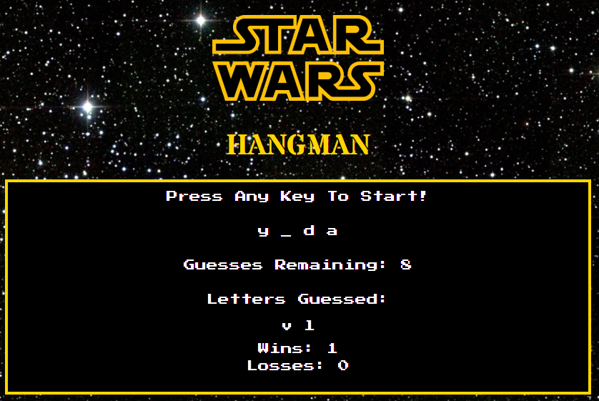

<h1>STAR WARS HANGMAN</h1>

<strong>Follow Link to Play:</strong> https://zsievers.github.io/Star-Wars-Hangman/

-I used basic <em>html</em> and <em>CSS</em> to format the page. 
-Used <em>javascript</em> to push the users key to the page.  
-If users guess is WRONG, letter is pushed to "Letters Guessed" div.  
-If users guess is CORRECT, letter is pushed to the chosen word.  

Technical Approach:
-press any key to start game
-have words ready to be guessed
-number of guess set
-have number of "_" to signify how many letters are in the current word
-have letters reveal themselves in the word or in letter pile when guessed. 
-If user guesses word, game stops and animation is cued. 
-if user doesn't get word in set amount of guesses, you lose animation is cued. 
-After win/loss the game automatically choose another word to and play again. 